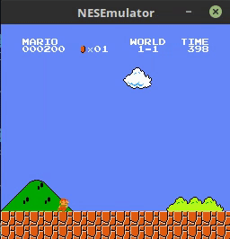
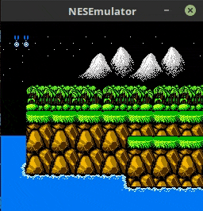
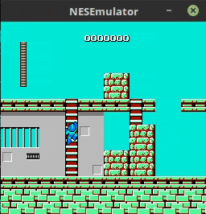
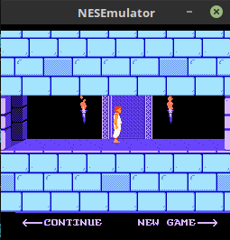

# NESEmulator
An emulator for the Nintendo Entertainment System - A Work in Progress

## Screenshots

  

Over the past few months, I've been working on creating an emulator for the Nintendo Entertainment System, a console from 1984
that singlehandedly brought back the videogame industry from the brinks of extinction.

It has specs that some may consider primitive in our times, with a paltry 2KB of RAM and a 1.79 Mhz 6502 CPU. It was a beast in its own age, however,
with its custom Picture Processing Unit being one of the foremost 2D picture processors of that age.

This project would not have been possible without the incredible reverse engineering knowledge on the Interwebs, particularly Nesdev, which proved to be an invaluable resource. 

## Current Status:

It is in a fairly stable state and is able to play many games (Including Donkey Kong, Contra, Super Mario Bros and more) perfectly (A minor glitch may pop up from time to time). 

The CPU has been
implemented with all of its instructions, and the baseline model for the PPU is ready. Although the PPU is mostly functional and pretty accurate, it needs to be refactored a fair bit. The PPU's scrolling is currently implemented in a crude manner, and needs to be refactored to become more cycle accurate.

Audio support has also been implemented with 3/5 Audio channels (2 pulse and 1 Triangle) present. However, the audio resampling is currently not satisfactory and a low pass filter will make it much clearer. 

One mapper (the UNROM mapper) has been implemented. I'm currently working on audio resampling and integrating MMC1 and MMC3 mappers. 

## Features

-> 150 instructions (All right, you got me 50 instructions with 5 addressing modes)  
-> Ricoh Picture Processing Unit  
-> Logging using SPDLog (Enable compile time options to see logs)  
-> Rendering using SDL  
-> Audio Processing Unit with 3/5 channels being implemented
## File Structure:

        ├── CMakeLists.txt
        ├── color_structs
        ├── cpu
        ├── include
        │   ├── apu.h
        │   ├── cartridge.h
        │   ├── controller.h
        │   ├── cpu.h
        │   ├── interrupt.h
        │   ├── memory.h
        │   ├── nes.h
        │   ├── ppu.h
        │   ├── sdl_handler.h
        │   └── util.h
        ├── lib
        ├── Makefile
        ├── rgb_struct_new.py - Helper script written to format the pallete colors in code
        ├── rgb_struct.py 
        └── src
            ├── apu.cpp - The Audio Processing Unit of the NES
            ├── cartridge.cpp - Contains code for handling Cartridge Loading
            ├── controller.cpp - Input Handled here
            ├── cpu.cpp - The brains of the 6502 CPU
            ├── interrupt.cpp - Interrupt Functionality
            ├── main.cpp - Driver code
            ├── memory.cpp - Memory Bus (Common between CPU and PPU)
            ├── nes.cpp - Wraps CPU, PPU and Controller
            ├── ppu.cpp - The Picture Processing Unit of the NES
            ├── sdl_handler.cpp - Wrapper for SDL code, the actual rendering happens here
            └── tests.cpp - A few tests (not exhaustive) for testing a few instructions

## Bird's eye view

At every step, the CPU reads the next instruction at the address specified by the Program Counter, executes it, while counting cycles.
The PPU runs 3 cycles for every CPU cycle, and there are a set of common memory locations used for communication between both. The PPU synthesizes an
image from these locations, and outputs an RGB array, which is rendered through SDL.

There are various strategies for keeping the CPU, PPU and APU in sync. I've gone with the run CPU an instruction and let the other units catch up strategy (Which works well till now).

## PPU Rendering

The PPU fetches a byte from an area known as the nametable, which contains an index into a pattern table. Each entry in the pattern table is of 16 bytes, and specifies an 8x8 pixel pattern.
The NES has a 64 color pallete, out of which 16 can be active at any one time. For indexing 16 palletes, we need four bits, and two come from the pattern table entry. Two more bits come from the screen area's corresponding
attribute table (Each 32x32 part of the screen shares an attribute).

Scrolling is done through xscroll and yscroll registers.

## PPU Registers
PPUCTRL  
PPUPPUMASK   
PPUSTATUS  
OAMADDR  
OAMDATA  
PPUSCROLL  
PPUADDR  
PPUDATA  

